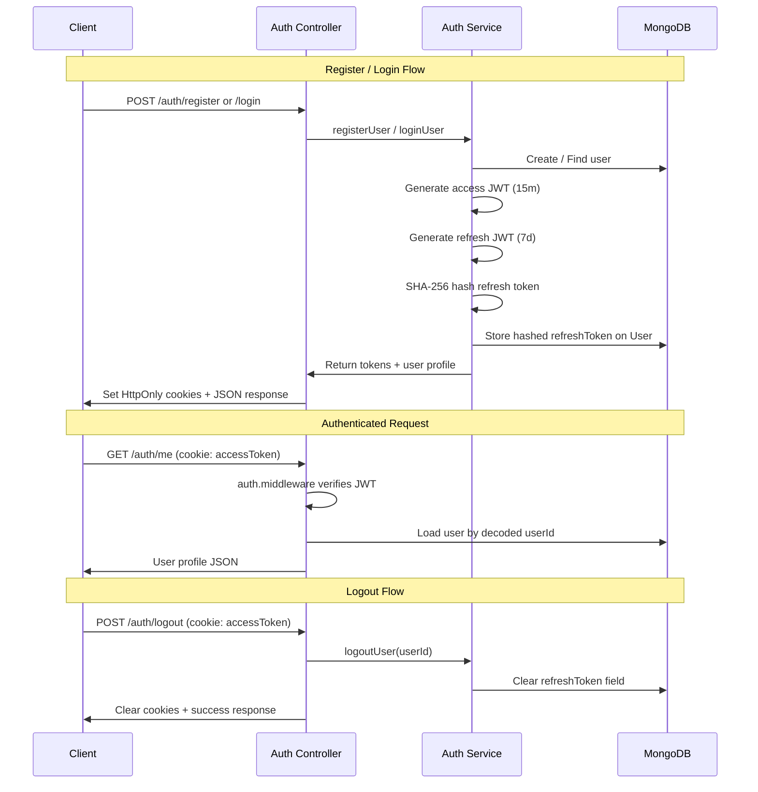

# BookVerse — Authentication Architecture

## Token Strategy



## Layer Architecture

```
Request
  └── routes/auth.routes.js
        ├── validators (express-validator)
        ├── validate.middleware.js
        └── controllers/auth.controller.js
              └── services/auth.service.js
                    ├── models/User.model.js
                    └── utils (jwt, cookie, tokenHash)
```

## Middleware Pipeline

| Middleware | Purpose |
|-----------|---------|
| `validate.middleware.js` | Runs express-validator results |
| `auth.middleware.js` | Verifies access JWT from cookie or Bearer header |
| `role.middleware.js` | Restricts routes by `USER` / `ADMIN` role |
| `error.middleware.js` | Centralized error formatting |

## Token Storage

| Token | Location | Lifetime | Stored Server-Side |
|-------|----------|----------|-------------------|
| Access Token | HttpOnly cookie / Bearer header | 15 minutes | No |
| Refresh Token | HttpOnly cookie | 7 days | Yes (SHA-256 hash on User) |

## Security Controls

- Passwords hashed with bcrypt (12 rounds) via Mongoose pre-save hook
- Password and refreshToken excluded from JSON responses (`select: false` + transform)
- Refresh token invalidated on logout (server-side revocation)
- CORS restricted to `CLIENT_URL` with `credentials: true`
- Cookies: `httpOnly`, `secure` in production, `sameSite: strict` in production
- Generic login error message prevents email enumeration
- Separate JWT secrets for access and refresh tokens

## Future (Step 3+)

- `POST /auth/refresh` — rotate tokens using refresh cookie
- Email verification flow (`isVerified`)
- Rate limiting on auth endpoints
- Account lockout after failed attempts
