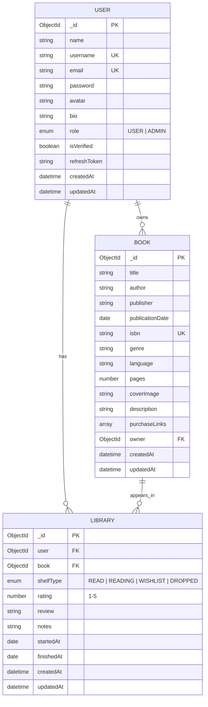

# BookVerse — Database Design

## Entity Relationship Diagram

## Relationships

| Relationship | Type | Description |
|-------------|------|-------------|
| User → Book | One-to-Many | A user owns many books (`Book.owner`) |
| User → Library | One-to-Many | A user has many library entries |
| Book → Library | One-to-Many | A book can appear in many users' libraries |
| User + Book → Library | Unique pair | One library entry per user per book |

## Indexes

### User
- `email` — unique (schema level)
- `username` — unique (schema level)
- `role` — filter admins

### Book
- `{ title, author, genre }` — text search
- `{ owner, createdAt }` — user's books by date
- `isbn` — unique sparse
- `genre`, `author` — filter queries

### Library
- `{ user, book }` — unique compound
- `{ user, shelfType }` — shelf filtering
- `{ user, shelfType, updatedAt }` — recent activity
- `{ book, rating }` — aggregate ratings

## Virtual Fields

| Model | Virtual | Purpose |
|-------|---------|---------|
| User | `displayName` | Alias for `name` |
| Book | `ownerProfile` | Populate owner details |
| Library | `readingDurationDays` | Days between start and finish |
| Library | `bookDetails` | Populate linked book |
| Library | `userProfile` | Populate linked user |

## Shelf Types

| Value | Behavior |
|-------|----------|
| `READ` | Auto-sets `finishedAt` if missing |
| `READING` | Auto-sets `startedAt` if missing |
| `WISHLIST` | Default shelf for new entries |
| `DROPPED` | User stopped reading |
